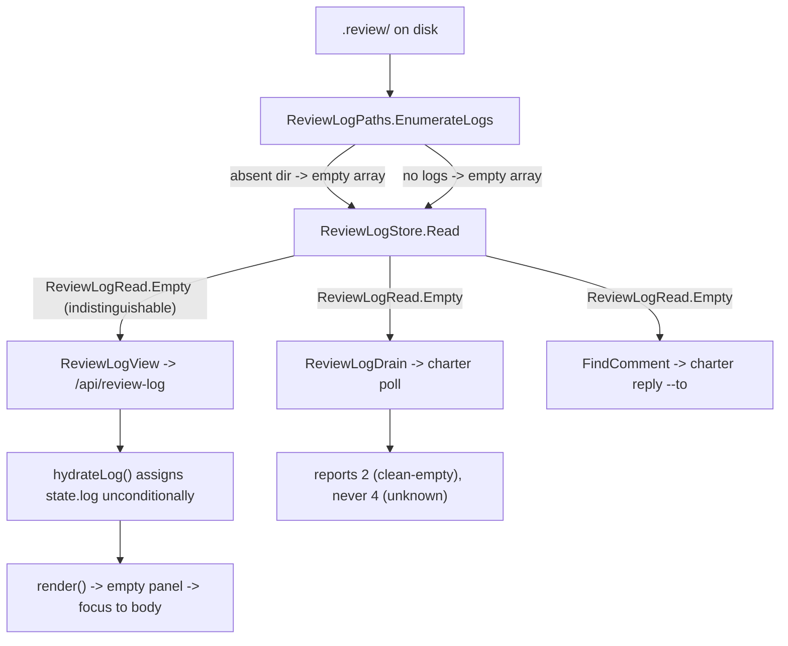

# The review log answers "I could not tell" instead of "nobody commented" (#221)

`charter review` intermittently drops the reviewer's keyboard focus to `<body>` while a teammate's note
arrives, and the panel briefly empties. The CI trace shipped in 0.27.0 named the mechanism on its first
real failure. Following it down lands somewhere larger than a focus bug: **the review log cannot tell an
absent directory from an empty one, and three different consumers take the stronger reading.**

## What the trace said

Master `ac42e246`, ubuntu-latest, `A_note_card_and_its_controls_keep_keyboard_focus_when_the_panel_is_rebuilt`:

```
focus-restored     key=item:cmt_e8d1…      built=n/a    panelHidden=false items=2 ids=cmt_e8d1…|cmt_1c6b…
focus-restored     key=item:cmt_e8d1…      built=n/a    panelHidden=false items=2 ids=cmt_e8d1…|cmt_1c6b…
focus-not-restored key=item-jump:cmt_e8d1… built=false  panelHidden=false items=0 ids=
```

`built=false` puts it in the #209 family — an empty entry set, not a hidden or disabled control. `items=0`
says why. And **`panelHidden=false` refutes the standing hypothesis**: the panel was visible, so "focus into
a `display: none` subtree silently does nothing" is not what happened here. Three teammate notes existed on
disk; the view returned **zero**.

## The conflation, in one method

`ReviewLogStore.Read` — and the doc comment says it out loud:

:::diff
```diff
 /// <summary>An empty read — no review directory, or no logs in it. Not an error.</summary>
 public static ReviewLogRead Empty { get; } = new(…);

 public static ReviewLogRead Read(string reviewDirectory)
 {
     var logs = ReviewLogPaths.EnumerateLogs(reviewDirectory);
-    if (logs.Count == 0)
-    {
-        return ReviewLogRead.Empty;      // "no logs" AND "no directory" AND "could not look"
-    }
```

`EnumerateLogs` returns `Array.Empty<string>()` when `!Directory.Exists(reviewDirectory)`. So a
momentarily-absent `.review/` and a plan nobody has commented on produce the **identical** value — empty
comments, empty `unreadable`, no error. Nothing downstream can distinguish them, because the distinction was
destroyed at the read.

:::warn
**This is the fourth instance of this codebase's signature defect.** #217 (a probe that could not tell
reported absence, and deleted the descriptor that proved otherwise), #223 (an advisory that could not tell
"needed" from "already done"), and #221's own `landChromeFocus` (one `false` for "no counterpart" and "a
counterpart that would not take focus"). Every time, the caller asserted the stronger fact. The doctrine
already written down for this repo is *when a predicate returns a bare boolean, ask what the false MEANS* —
here it is a bare empty list, and it means two things.
:::

## Why this is not only a focus bug

`ReviewLogStore.Read` has **three** callers, and the panel is the least serious of them.

:::comparison
| Consumer | What an Unknown read looks like today | Cost |
|---|---|---|
| `ReviewLogBridge.ReviewLogView` → `/api/review-log` (the panel) | The panel empties, `renderPanel` builds nothing, `restoreChromeFocus` has no counterpart, focus lands on `<body>`. Self-heals on the next read. | **Visible, transient.** The reported bug. |
| `ReviewLogDrain` → `charter poll` | `read.State.Comments` is empty, so `fresh` is empty and the drain reports **nothing queued**. | **Silent and wrong.** An agent is told the reviewer said nothing. |
| `ReviewLogBridge.FindComment` → `charter reply --to` | The target comment is "not found". | A reply is refused against a comment that exists. |
:::

The drain is the one that matters. `charter poll` already has a vocabulary for exactly this — its documented
exit codes are `0` drained · `2` a queue was found and it was EMPTY · `3` no session or log · **`4` the drain
could not complete, so the queue state is UNKNOWN — never read this as "nothing queued"**. The contract
already distinguishes empty from unknown; the read underneath it cannot, so **exit 4 is unreachable for this
cause** and a transient directory blip is reported as a clean, confident `2`.

:::note
**The honest-answer discipline is already in that same method, one input over.** `ReviewLogDrain` reads the
plan with `TryReadPlan` and comments: *"an unreadable plan orphans everything and answers `unknown` for every
base, which is the honest answer when nothing can be verified."* It applies that to the **plan** and not to
the **log directory**. The fix is to extend a principle this file already holds, not to introduce one.
:::

## Where the read sits

:::diagram

:::

## The precedent this should follow

`ProbeResult` already solved this shape in this repo, for #217:

- three outcomes — `Live` / `Absent` / `Unknown`;
- an `IsAbsent` property that exists **specifically so no caller reaches for `!IsLive`**, the spelling that
  caused the original bug;
- callers that must handle Unknown distinctly — `poll` exits 4 on it, and pruning happens only on Absent.

`ReviewLogRead` wants the same treatment: an outcome that separates *"there are no comments"* from *"I could
not read the directory just now"*, with the property named so the negation is not reachable by accident.

## What must not regress

- **A plan nobody has commented on is a normal state, not a failure** — that is what `ReviewLogRead.Empty`'s
  doc comment gets right, and the common path must stay silent and cheap.
- **`.review/` is created lazily, on the first append** (plan-03 §5.0). A `charter review` that writes no
  comment must leave no trace beside the plan, so "the directory does not exist" is the *usual* state of a
  solo review and must not become a warning, an error, or an Unknown.
- **The server reads git, never writes it**, and this touches no git path.
- The `poll` / `resolve` exit-code contract is public and consumed by agents: `2` and `4` already mean what
  they mean. This should make `4` reachable, never redefine either.

## Scope

**In:** a third state on the review-log read; each of the three consumers handling it distinctly; a
deterministic reproduction; the SDK declining to apply an Unknown view rather than emptying the panel.

**Out:** any change to the fold's semantics or to `ReviewLog.Fold`; the `.gitignore`/tracked-ness rules
around `.review/`; the annotation-queue path, which #209 already guards with its own write clock; making
`charter review` create `.review/` eagerly, which would break §5.0 solo primacy.

**Deferred, and tracked:** nothing new. The one dependency is #221 itself, which this plan closes.

## Build order

1. **Reproduce it deterministically, red — at the BROWSER level.** A test that intercepts
   `/api/review-log` at the Playwright route boundary and delivers a genuine empty view at a chosen moment:
   the `HoldFirstQueueReadAsync` technique #209 used, where every byte is the server's and only the timing
   is the test's, which is what made that race reproduce identically on every runner and both engines. It
   reproduces the **reported** failure — focus landing on `<body>` — end to end.
2. **The third state** on `ReviewLogRead`, with the property named so `!IsPresent` is not the reachable
   spelling. A short **bounded** retry sits in front of it, mirroring the per-file `TryReadAllText` that
   already tolerates a concurrent append; the bound is part of the deliverable, because an unbounded retry
   hangs the panel instead of emptying it.
3. **The three consumers**, each deciding for itself — the panel declines, **the drain reaches exit 4**,
   `FindComment` refuses to report "not found" on an unread directory.
4. **The SDK guard** in `hydrateLog()`, declined out loud the way #209's is (`stale: true` is a structural
   fact a test can assert, so the branch cannot rot into one nothing proves was taken).
5. **Both engines**, then the whole suite.

:::warn
**The drain gets no deterministic RACE reproduction, and that is a decided trade — record it, do not
quietly close it.** `repro-level` selected the browser-level intercept alone, so the consumer with the
*silent* failure mode has no test that recreates the race that produces it.

Read the boundary precisely, because it is narrower than it first sounds. The drain's **mapping** —
Unknown ⇒ exit 4 — is still in scope at step 3 and the TDD pair there will pin it like any other behaviour.
What is not built is a test that drives `charter poll` through a genuine mid-read directory blip. So the
translation is proven and the *trigger* is proven only at the panel. If the drain ever regresses by ceasing
to receive Unknown at all — rather than by mistranslating it — the browser test would not notice.
:::

## Decisions we need from you

:::question
{ "id": "where-the-third-state-lives", "title": "Where should the absent/empty distinction be made?",
  "mode": "single",
  "options": ["On the server, as a third outcome on ReviewLogRead (the ProbeResult shape)", "On the client only, as a heuristic in hydrateLog that declines a view that would empty a populated panel", "Both — server outcome, and a client guard that declines regardless"],
  "recommended": "On the server, as a third outcome on ReviewLogRead (the ProbeResult shape)",
  "rationale": "The distinction is destroyed at the read, so only the read can restore it — a client heuristic cannot tell an absent directory from a genuinely emptied one, and would have to guess from the previous state, which is exactly the kind of inference that made #209 hard. The server option also reaches the two consumers the client cannot help at all: the drain behind charter poll and FindComment behind charter reply. ProbeResult is the same fix for the same shape in this repo and its IsAbsent naming rule is worth copying verbatim.",
  "target": "human", "answer": ["On the server, as a third outcome on ReviewLogRead (the ProbeResult shape)"] }
:::

:::question
{ "id": "drain-exit-code", "title": "What should charter poll do when the review log reads Unknown?",
  "mode": "single",
  "options": ["Exit 4 — the existing 'drain state unknown' code", "Exit 3 — no session and no readable log", "Exit 2 with a diagnostic, so scripts branching on 2 keep working"],
  "recommended": "Exit 4 — the existing 'drain state unknown' code",
  "rationale": "Exit 4 already means precisely this and its documentation already warns never to read it as 'nothing queued' — the contract was written for this case and is currently unreachable for it. Exit 3 would claim there is no log at all, which is a different and equally wrong assertion. Exit 2 is the status quo and is the actual defect: it reports a clean empty queue, which is what tells an agent the reviewer said nothing.",
  "target": "human", "answer": ["Exit 4 \u2014 the existing \u0027drain state unknown\u0027 code"] }
:::

:::question
{ "id": "retry-before-unknown", "title": "Should the server retry a failed directory read before answering Unknown?",
  "mode": "single",
  "options": ["Yes — a short bounded retry, matching the per-file TryReadAllText that already tolerates a concurrent append", "No — answer Unknown immediately and let the caller decide", "Yes, and only for the panel read; the drain answers immediately"],
  "recommended": "Yes — a short bounded retry, matching the per-file TryReadAllText that already tolerates a concurrent append",
  "rationale": "TryReadAllText already retries per file precisely because a concurrent append or a git checkout creates brief sharing conflicts, so the directory-level read is inconsistent in not doing the same. A transient absence resolves in milliseconds, and a retry turns most Unknowns back into real answers before any consumer has to degrade. The risk is bounding it badly — an unbounded retry would hang the panel — so the bound is part of the decision rather than an afterthought.",
  "target": "human", "answer": ["Yes \u2014 a short bounded retry, matching the per-file TryReadAllText that already tolerates a concurrent append"] }
:::

:::question
{ "id": "repro-level", "title": "At which level should the deterministic reproduction live?",
  "mode": "multi",
  "options": ["A server test that drives ReviewLogStore.Read against a directory it removes mid-read", "A browser test that intercepts /api/review-log at the Playwright route boundary and delivers an empty view at a chosen moment", "A drain test asserting charter poll reaches exit 4 rather than 2"],
  "recommended": "A browser test that intercepts /api/review-log at the Playwright route boundary and delivers an empty view at a chosen moment",
  "rationale": "The browser-level intercept is the one that reproduces the REPORTED failure — focus landing on body — and #209's version of it ran identically on every runner and both engines, which is what makes a race testable at all. The server and drain tests are cheaper and pin the other two consumers, so this is a question of how many to build rather than which one is right; the browser test alone would leave the drain regression uncovered, and the drain is the consumer with the worst failure mode.",
  "target": "human", "answer": ["A browser test that intercepts /api/review-log at the Playwright route boundary and delivers an empty view at a chosen moment"] }
:::
