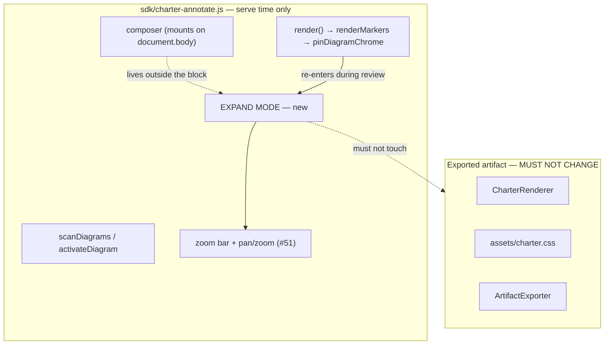

# Full-screen expand mode for an oversized `:::diagram` (#234)

A reviewer looking at a two-subgraph "current vs. proposed" architecture diagram cannot see both halves at a
legible size. The block's column width bounds the pan/zoom viewport, so the choice today is *pan blind* or
*zoom out until the labels are unreadable*. This plan adds a **review-time expand mode**: one diagram
temporarily takes the whole browser viewport, keeping zoom, pan, and per-node annotation.

The feature was filed in August and deliberately **not** built, as a sequencing decision — it puts a
focus-taking overlay on the review page, and focus-across-rebuild is exactly where **#221** is an
undiagnosed defect. That decision is revisited here rather than assumed, because the shape of the fix
turns out to matter more than the timing.

## The headline: the mechanism is small, the interaction surface is not

The single most useful thing to know before estimating this: **#51 already did the hard part, and it did it
in the way that makes this feature cheap.**

Zooming a diagram does not use a CSS transform. It *widens the `<svg>` itself* — `width: base × scale;
max-width: none` — and lets the block be an ordinary scroll container. The design note in
`sdk/charter-annotate.js:3646` is explicit about what that buys, and every item on its list is something
expand mode would otherwise have had to re-earn:

- crisp vector text at every scale (a transform rasterizes),
- `getBoundingClientRect()` and hit-testing that are simply **correct**, so `Alt`+click still resolves the
  Mermaid node under the pointer with no new maths,
- arrow-key panning for free, because a focusable scroll container already does it,
- the annotation overlay following a pan through the SDK's existing capture-phase `scroll` listener.

Because there is **no coordinate frame of Charter's own**, making the container bigger is very nearly the
whole feature. Zoom, pan, hit-testing and the overlay do not need to know it happened.

:::note
The estimate that follows is therefore lopsided on purpose. The drawing code is small and low-risk; the
cost is concentrated in focus, the composer, re-entrancy and the two browser engines. Read the risk
section as the real estimate, not the line count.
:::

## Where the feature has to live

:::diagram

:::

`DiagramPanZoomArtifactTests` exists to keep that boundary: it fails if pan/zoom styling reaches
`charter.css`, the renderer, or the exporter. Expand mode inherits the same rule — **all of it is SDK
chrome, injected at serve time, and the exported artifact stays byte-identical.** That is also what #234
itself asked for, so nothing here is in tension with the issue.

## The decision that drives everything else

Three ways to make one diagram fill the viewport. They are not equivalent, and one of them is disqualified
by evidence rather than by taste.

:::comparison
| Approach | How | Verdict |
|---|---|---|
| **In-place `position: fixed`** | Add a class to the existing `<pre class="mermaid">`; it stays exactly where it is in the DOM and is painted over the page. | **Recommended.** No reparent, so nothing about ancestry, anchors or the source map changes. The composer still paints, because it is a sibling on `document.body` and z-index is ours to order. |
| **Reparent into an overlay** | Move the block into a new full-viewport element, move it back on exit. | Works, but buys nothing the option above lacks and adds a restore path that must survive every exit route — Escape, toggle, live-reload navigation, an exception mid-gesture. A block left in the overlay is a corrupted page. |
| **Native Fullscreen API** | `block.requestFullscreen()`. | **Disqualified — it breaks requirement 4 of the issue.** |
:::

:::warn
**Why the native Fullscreen API is out, concretely.** In fullscreen, the browser renders *only the
fullscreen element and its descendants*. The annotation composer is appended to `document.body`
(`sdk/charter-annotate.js:2576`), not to the diagram block — so `Alt`+click on a node inside a fullscreened
diagram would open a composer that **exists, receives focus, and is invisible**. The issue explicitly
requires per-node annotation to keep working while expanded, so this is a functional failure and not a
cosmetic one. It is recoverable only by reparenting the composer into the fullscreen element, which
re-introduces every restore-path problem of the middle option *and* adds the browser's own exit events on
top. The free Escape handling is not worth it.
:::

## The risk that actually sets the difficulty: focus, and #221

#234 was deferred because an overlay takes focus and #221 is an unexplained focus defect. That reasoning
still holds, but the codebase says something more specific.

Focus reaches `<body>` by **three** routes, and each needed its own answer: a control that hides itself
(#168), a control rebuilt away by `render()` (#200), and a control that disables itself under the reviewer
(#204). #221's leading hypothesis is a fourth flavour of the same family — **focus into a `display: none`
subtree silently does nothing**, and the panel hides exactly that way.

That points at a scope rule rather than a delay:

:::note
**The expand view must not hide any existing chrome.** No `display: none` on the panel, the composer, or
the page behind it. Paint over it, dim it, make it inert if necessary — but do not remove it from the
layout. Doing so would manufacture more of the exact condition #221 has not yet been explained by, on the
page where it is already failing.
:::

Beyond that, everything the review page already knows about focus applies unchanged:

- Any focus rule needs an **anti-steal control** alongside it (#200). "Always restore focus" passes
  everything without one.
- `render()` re-enters during a review — a teammate's record arriving over SSE is enough — and it is one
  synchronous turn ending in `restoreChromeFocus`. Expand mode must be re-entrant across it.
- An element reference does **not** survive an `await` inside a probe, because `renderMarkers` opens with
  `clearMarkers()` (#198). Re-resolve after the last `await`, keep measurements synchronous.

One collision resolves itself pleasantly: **Escape**. The composer already handles Escape and calls
`stopPropagation()` (`sdk/charter-annotate.js:2599`), so a document-level "Escape exits expand mode"
listener will not fire while a composer is open. Escape closes the composer, then Escape exits the expand
view — the precedence a reviewer would expect, for free.

## What the tests will cost

More than the feature, and the repo's own history says why: C#-string golden tests over rendered markup
were blind to four shipped defects, every one of which a human hit immediately. Anything a human sees or
clicks needs a **browser** test that clicks the real control.

The specific traps this feature walks into, all of them already documented and all of them already paid for
once:

- **Playwright passes `--hide-scrollbars` to headless Chromium by default**, so a test measuring a scroll
  affordance measures the flag. Expand mode is a scroll container; its tests need
  `TryLaunchAsync(showScrollbars: true)` and the declared-vs-laid-out gutter comparison the existing
  `Every_*` sweeps use.
- **The served CSP refuses `WaitForFunctionAsync` once it has to poll** — it *appears* to work whenever the
  condition is already true on the first check. Use `WaitForSelectorAsync` or a bounded C# poll.
- **`WaitForEventAsync` asks "has this ever happened"**, so the second one in a test returns instantly. Use
  `WaitForEventCountAsync`.
- **`document.elementFromPoint` is viewport-relative and `scrollIntoView` scrolls every scrollable
  ancestor** — centring a badge inside a `<pre>` scrolls the `<pre>` back to column one. Scroll once,
  before either reading.
- **Both engines.** CI runs Chromium and WebKit, and WebKit is where #221's failures actually appear.

## Scope

**In:** an expand **button in the existing zoom bar**; a **hint in the zoom bar's hint text** when the
diagram is wider than the column; collapse by button and by Escape; zoom, pan and per-node `Alt`+click
annotation working while expanded; the expanded view **staying open across `render()`**; keyboard reach and
an accessible name; both engines.

**Out:** any change to the exported artifact (explicitly out, per #234 and `DiagramPanZoomArtifactTests`);
**a keyboard shortcut as a discovery route** — offered in review and not taken, so the button and the hint
are the only ways in (Escape still *leaves*, which is an exit, not a discovery mechanism); expand for
non-diagram blocks; touch pinch gestures beyond what the browser already gives; a diagram nested inside
another container, which has **no anchor of its own** and is already refused the zoom affordance.

**Deferred, and tracked:** nothing new is deferred by this plan. The one dependency it leans on is **#221**,
which is open, owned, and the subject of the scope rule above.

## Build order

1. **Tests first, red.** The expand button's existence, its accessible name, and a collapsed→expanded→
   collapsed round trip. Falsify each before implementing — a test never seen to fail is a hypothesis about
   your own code.
2. **The button and the expanded container**, in-place `position: fixed`, no reparent, nothing hidden.
3. **The hint**, and its precedence rule. `view.hint` is a single `` that `syncZoomBar` already
   drives between two states — `'Ctrl+scroll to zoom'` at fit and `'drag or arrow keys to pan'` once zoomed
   (`sdk/charter-annotate.js:3875`). An expand hint is a third state competing for the same slot, so decide
   what wins when the diagram is both too wide *and* already zoomed. Cheap to build, easy to make noisy.
4. **Re-entrancy**: append a second author's record to `<plan>.review/` while expanded and assert the view
   is **still open** afterwards — the answer to `expand-persistence` — with an anti-steal control on the
   focus half.
5. **Annotation while expanded**: `Alt`+click a Mermaid node, assert the **posted payload** carries the
   node's sub-anchor — not merely that a composer opened.
6. **Both engines**, then the artifact-invariance guard.

## Decisions we need from you

:::note
**All four are answered and folded into the scope and build order above. Nothing here is outstanding.**

The decisive one was `sequencing-vs-221`: **build now, under a hard rule that expand hides no existing
chrome.** That is not a scheduling answer — it is a constraint on the implementation, and it is the reason
the "no `display: none`" rule above is a requirement of this plan rather than a preference. Work built from
this plan must not wait on #221, and must not relax that rule while #221 is undiagnosed.
:::

:::question
{ "id": "expand-mechanism", "title": "How should the expanded diagram fill the viewport?",
  "mode": "single",
  "options": ["In-place position: fixed on the existing block", "Reparent the block into a full-viewport overlay", "Native Fullscreen API (requestFullscreen)"],
  "recommended": "In-place position: fixed on the existing block",
  "rationale": "The composer is appended to document.body, not to the diagram block, so under the native Fullscreen API an Alt+click annotation would open a composer that is invisible — a functional failure against requirement 4 of the issue, not a cosmetic one. Reparenting works but adds a restore path that must survive Escape, the toggle, live-reload navigation and an exception mid-gesture, and buys nothing the in-place option lacks. In-place keeps DOM ancestry, anchors and the source map untouched.",
  "target": "human", "answer": ["In-place position: fixed on the existing block"] }
:::

:::question
{ "id": "sequencing-vs-221", "title": "Build this now, or wait until #221 is diagnosed?",
  "mode": "single",
  "options": ["Build now, with a hard rule that expand hides no existing chrome", "Wait until #221 is diagnosed and fixed", "Build now with no constraint and treat any focus fallout as #221's problem"],
  "recommended": "Build now, with a hard rule that expand hides no existing chrome",
  "rationale": "The original deferral was right that this adds a focus-taking overlay to the page where #221 is unexplained. But #221's leading hypothesis is specifically that focus into a display:none subtree silently does nothing — which makes it a constraint on HOW to build rather than a reason to wait. Forbidding display:none in the expand path avoids manufacturing more of the suspected condition, and #221 may sit undiagnosed for a while yet since it needs a failing CI trace to progress.",
  "target": "human", "answer": ["Build now, with a hard rule that expand hides no existing chrome"] }
:::

:::question
{ "id": "expand-persistence", "title": "Should the expanded view stay open when render() re-enters?",
  "mode": "single",
  "options": ["Stay open — a teammate's comment must not close the reviewer's view", "Collapse on any render, and let the reviewer re-expand"],
  "recommended": "Stay open — a teammate's comment must not close the reviewer's view",
  "rationale": "render() fires on every save, every hydrate and every review-log SSE frame, so collapsing on render means a teammate commenting elsewhere in the plan yanks the diagram out from under whoever is reading it. Staying open is also the cheaper option here: render() rebuilds only SDK chrome, not the plan's DOM, and the zoom bar built by activateDiagram already survives it, so expand state on the block survives by the same route.",
  "target": "human", "answer": ["Stay open \u2014 a teammate\u0027s comment must not close the reviewer\u0027s view"] }
:::

:::question
{ "id": "expand-discovery", "title": "How should a reviewer discover expand mode?",
  "mode": "multi",
  "options": ["A button in the existing zoom bar", "A keyboard shortcut", "A hint in the zoom bar's hint text when the diagram is wider than the column"],
  "recommended": "A button in the existing zoom bar",
  "rationale": "The zoom bar is already the discoverable, keyboard-reachable, touch-usable path and the only control a reviewer has to find, so a button there costs no new discovery surface. A shortcut alone would be undiscoverable; the hint is cheap but only earns its place if it appears when the diagram is actually too wide, which is the condition that motivated the issue.",
  "target": "human", "answer": ["A button in the existing zoom bar","A hint in the zoom bar\u0027s hint text when the diagram is wider than the column"] }
:::
