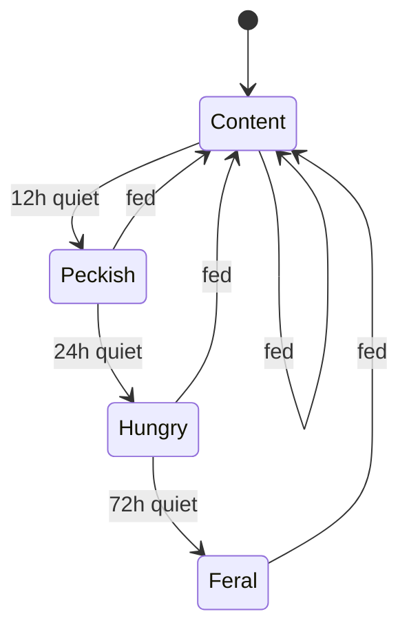

# Desk Pet — a terminal companion fed by your commits

A tiny CLI pet that lives in your shell and gets hungry when you stop committing. You run
`deskpet`, it prints your pet's mood. You commit something, it perks up. That is the entire
product.

You asked for behaviour rather than architecture, so this chart spends its length on how the pet
should *act* — and leaves the four decisions I genuinely can't make for you open at the bottom.

:::note
Scope for this first slice: one pet, one repo, one JSON file at `~/.deskpet/state.json`. No
server, no accounts, no network. Everything below assumes that floor.
:::

## The mood machine

Mood decays with silence and resets when the pet is fed. Four states is enough to be expressive
without needing a manual.

:::diagram

:::

The thresholds above are a starting guess, not a recommendation — 12/24/72 hours simply makes the
pet notice a lunch break, a busy day, and a long weekend at three different volumes.

:::warn
**The weekend is the whole problem.** With decay running continuously, a pet fed on Friday evening
is Feral by Monday morning — so the tool's first interaction of every week is a reproach for not
working the weekend. That is a culture signal, not a bug you can patch later, and it is the single
decision most likely to make someone uninstall this. It is the first open question below.
:::

## What counts as feeding it?

You flagged this as undecided, so here are the four candidates side by side. The rows are not
equally good, and the last one is on the list only so it can be ruled out explicitly.

:::comparison
| Signal | Rewards | Punishes | Gameable? | Effort |
|---|---|---|---|---|
| Any commit | Frequent, small commits | Nothing | Trivially — `git commit --allow-empty` | One hook line |
| Tests passing | Code that actually works | Slow suites; red-while-refactoring | Hard | Hook must run the suite |
| PRs merged | Shipped, reviewed work | Solo work; long-lived branches | Hard | Needs a forge API + auth |
| Lines changed | Volume | Careful, surgical edits | Yes, and it rewards the gaming | One hook line |
:::

:::note
My read, for what it's worth: **any commit** is the right first slice. It is one line, it has no
auth story, and its gameability is a feature at this size — someone who fakes a commit to cheer up
a cartoon is enjoying the tool, not defeating it. **Lines changed** is the one row I'd rule out
permanently; it is the only option that rewards work you don't want.
:::

## The hook

`deskpet init` appends to `.git/hooks/post-commit`:

:::diff
```diff
--- a/.git/hooks/post-commit
+++ b/.git/hooks/post-commit
@@ -1,3 +1,8 @@
 #!/bin/sh
 # any existing hooks keep running first
 ./scripts/lint-staged.sh
+
+# Desk Pet: note that the repo saw activity.
+# `|| true` is load-bearing — see below.
+deskpet feed --quiet || true
```
:::

:::warn
That `|| true` is not defensive padding. A `post-commit` hook that exits non-zero can disrupt the
committing workflow, and a toy that interferes with someone's commits gets uninstalled the same
afternoon. Desk Pet must be incapable of costing anyone a commit — if `deskpet` is missing, broken,
or slow, the commit still succeeds and the pet simply goes hungry.
:::

## State

```json
{
  "name": "Pixel",
  "mood": "Content",
  "lastFed": "2026-08-02T09:14:00Z",
  "bornAt": "2026-08-01T17:02:11Z"
}
```

## Explicitly out of scope

| Idea | Why not now |
|---|---|
| Multiple pets | The second one teaches you nothing the first didn't |
| Team leaderboard | Turns a desk toy into surveillance |
| Cross-repo aggregation | Needs a daemon; this slice is one binary |
| Pet death | Cute in the abstract, genuinely upsetting in practice — deserves its own decision, not a footnote |

## Decisions I need from you

:::question
{ "id": "weekend-decay", "title": "Does the pet keep getting hungrier over the weekend?",
  "mode": "single",
  "options": ["Yes — decay never pauses", "No — pause Sat/Sun entirely", "Slower decay on weekends"],
  "target": "human" }
:::

:::question
{ "id": "food-signal", "title": "Which signal feeds the pet?",
  "mode": "single",
  "options": ["Any commit", "Tests passing", "PRs merged", "Lines changed"],
  "target": "human" }
:::

:::question
{ "id": "guilt-trip", "title": "May the pet ever guilt-trip you — e.g. 'you haven't visited in 3 days'?",
  "mode": "bool", "target": "human" }
:::

:::question
{ "id": "pet-name", "title": "What should the default pet be called before the user renames it?",
  "mode": "free-text", "target": "human" }
:::
