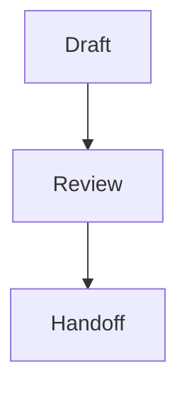

# charter-format — the normative Charter block catalog

A Charter deliverable is a `.charter.md` file: **CommonMark prose plus `:::` directive containers**
(Markdig custom containers), each validated against a C# record in `Charter.Core`. This skill is the
**single source of truth** for that format — the block catalog, each block's semantics, and the
`:::question` open/resolved rule. It is bound to the renderer by a drift test (`Charter.Core.Tests`), so
this catalog and the real `BlockKind` set / `QuestionSpec` fields can never silently diverge.

Do not invent, fork, or vendor this catalog. Cite this skill.

## Format version

This skill declares the format range it understands in its frontmatter:

- `format-version: 1` — the newest catalog version this skill defines (`skillMax`).
- `format-min: 1` — the oldest file format it still understands (`skillMin`).

A `.charter.md` stamps the format it was authored against in a plain-YAML frontmatter marker
(`charter-format-version: F`, readable without this skill). It is consumable iff
`format-min ≤ F ≤ format-version`. **Any change to the catalog below bumps `format-version`** — the drift
test binds the version to the code, so a semantic change with no bump fails the build.

### If you are a CONSUMER of this skill

You may not be a Charter agent at all. Guardrails' `plan-breakdown` cites this skill as the authority for
interpreting a `.charter.md`, and other tools may too. So the numbers above are stated **here, in the body**
rather than only in frontmatter: frontmatter is discovery metadata and does not reliably reach your context,
and the copy you can actually read is the copy you are actually using.

**Check the pairing before you interpret a plan**, because nothing else can. Charter's `--version` compares
this skill to the *Charter* binary; your own tool's `--version` compares *its* skills to *itself*. Neither
looks at the pair, so both can be perfectly clean while this skill is too old to read the plan in front of
you:

1. Read the plan's `charter-format-version: F` marker — plain YAML, no parsing of this skill required.
2. Compare against the range above. Consumable iff `format-min ≤ F ≤ format-version`.
3. **`F` greater than `format-version`** — the plan uses a catalog generation this skill does not define.
   Do not guess at the unknown blocks; a `:::` directive you cannot interpret is not prose to be passed
   through.
4. **`F` less than `format-min`** — the plan predates what this skill still understands.

**The remedy lives in Charter's repo, not yours.** A stale `charter-format` is fixed by:

```
charter skills install --force
```

…and then restarting your session, because the copy you loaded does not change when the file on disk does.
That is a *Charter* command, which is exactly why it is written here — a Guardrails-side agent has no reason
to think of it, and re-installing its own skills will not help.

## The block catalog (the only blocks that exist)

Primitives are plain CommonMark. The `:::` directives are the rich, validated blocks.

| Block | Syntax | Semantics |
|---|---|---|
| prose / heading / list / table / code | plain CommonMark | Narrative and data. Annotatable as a whole block, or as a text range inside it. A **top-level** list is additionally annotatable **per item** — a list nested inside an item, or inside a callout, is not. (Per-line sub-anchors exist only for `:::diff`; a code block has none.) |
| note callout | `:::note` | An aside. Rendered as a callout; annotatable as a whole element. |
| warn callout | `:::warn` | A risk the reviewer must not miss. A callout; annotatable as a whole element. |
| comparison | `:::comparison` | Options weighed side by side — a pipe table or list body. Annotatable **per row**. |
| diagram | `:::diagram` | A Mermaid diagram. Body is Mermaid source — raw, **or** wrapped in a fenced ` ```mermaid ` block (both accepted; see below). Rendered theme-aware; annotatable **per node**. |
| diff | `:::diff` | A unified diff. Body is diff lines — raw, **or** wrapped in a fenced ` ```diff ` block (both accepted; see below). Annotatable **per line** (add / remove / context). |
| custom HTML | `:::custom-html` | The sanctioned raw-HTML escape hatch — its body is passed through live (every other surface escapes raw HTML). Reach for it last. Annotatable **as a whole block only**: an `id` you write inside the body is yours, not an anchor, and a note taken anywhere in it belongs to the block. |
| **question** | **`:::question`** | The elicitation block — asks the human (or downstream agent) to decide something inside the plan. Validated JSON body; see below. |

There is **no** `:::file-tree` and **no** `:::annotated-code`. They have no renderer — do not author them,
and treat any other unknown `:::foo` as an unknown directive, never as a known block.

**A `:::` directive must be a top-level block.** The same rule the list row above states for per-item anchors,
and for the same reason: Charter's block model is the plan's top-level nodes, in document order, so a directive
written inside a callout, a list item or a blockquote is **not a block**. It has no anchor and no source-map
entry, it never appears in the forensic record, and the flatten emits its body — fence lines and all — as
blockquoted prose belonging to whatever contains it.

For `:::question` that is not cosmetic, and it is the one case Charter now refuses outright: a nested question
used to render as a real, answerable form whose answer could never be folded back into the plan. It renders as
a **visible, non-answerable placeholder** instead, `charter headless` reports needs-human over it, and
`charter handoff --fail-if-needs-human` blocks. A nested `:::diff` blocks too — flattened as prose, its
line-initial `+` and `-` are read as CommonMark bullet markers, so an added and a removed line become
indistinguishable. Every other nested directive is a warning: `render`, `review` and `handoff` name it on
stderr with its line.

Prose above or below a callout reads the same as prose inside one. Put the directive at the top level.

*One exception, and it is not really one: `:::custom-html`, `:::diagram`, `:::diff` and an unknown `:::foo`
never render their bodies as blocks at all, so a `:::` line inside one of those is just text you wrote — see
"Widening a fence" below, which is about keeping it that way.*

**Unknown-directive interop rule.** An unknown `:::foo` is flagged as unknown (never silently promoted to a
note) — but its **body is preserved and parsed through as prose context, never silently dropped**. It is
ordinary plan content that happened to sit behind a directive the catalog does not define (usually a typo);
discarding it would lose real content. Every consumer — renderer, handoff, and any interpreting agent — keeps
both the visible "unknown directive" marker *and* the body.

### `:::diagram` and `:::diff` body forms

Both containers accept **two** body forms, and both mean exactly the same thing. Write either; interpret both.

**Fenced body** (the form the authoring examples use — it keeps editors syntax-highlighting the source):

````markdown
:::diagram

:::
````

**Raw body** (no inner fence):

````markdown
:::diagram
graph TD; Draft --> Review --> Handoff;
:::
````

`:::diff` is identical, with ` ```diff ` as the inner fence:

````markdown
:::diff
```diff
+ added line
- removed line
  context line
```
:::
````

````markdown
:::diff
+ added line
- removed line
  context line
:::
````

When flattening, the body is emitted as **exactly one** fenced code block of the matching language — an
already-fenced body is unwrapped first, never double-fenced.

### Widening a fence when the body contains one

A body may legitimately contain the very characters that delimit it — a diff of a markdown file is the
common case. **Both** delimiters then have to be widened, and getting only one is a silent data loss, not a
rendering glitch:

- **the container**: a line whose trimmed text is a colon run of at least the opening length **closes** the
  block, and everything after it is dropped. Being inside a code fence does **not** protect it — the
  container's close check runs first. Open with `::::` (or more) when any body line starts with `:::`.
- **the code fence**: three backticks are closed by a body line of three backticks. Use ` ```` ` when the
  body contains a fence.

A body line reading `:::note` would otherwise **open a nested directive** and swallow the tail; the code
fence is what prevents that, which is why a machine-generated diff body is always fenced.

````markdown
::::diff
```diff
 :::note
-  a line inside a .charter.md being diffed
+  the block survives because the container is four colons
```
::::
````

Only widen as far as the content requires — an ordinary source diff stays plain `:::diff` + ` ```diff `.
`charter recap` computes both automatically.

## The `:::question` block — open vs. resolved

The body is a JSON object (JSON is a subset of YAML, so the parser stays dependency-agnostic) validated to
`QuestionSpec` in `Charter.Core`. Its fields:

| Field | Type | Required | Meaning |
|---|---|---|---|
| `id` | string | yes | Stable, **document-unique** question id. (Two questions sharing an id is a review-time error — an answer would resolve into both.) |
| `title` | string | yes | The question shown to the reviewer. |
| `mode` | string | yes | One of `single` / `multi` / `free-text` / `bool` / `number`. |
| `options` | array of strings | for `single`/`multi` | The choices. Required and non-empty for the select modes; unused otherwise. |
| `target` | string | yes | `human` or `agent` — who the resolved answer routes to. |
| `recommended` | string | no | The option the **authoring agent** would choose. Must equal one of `options` verbatim; a value matching none is ignored. |
| `rationale` | string | no | Why the agent is asking, or why it leans as it does. Plain text, rendered **inside** the question. |
| `answer` | array of strings | no | **The open/resolved marker.** Absent, empty, or carrying **any blank value** ⇒ the question is **open**. One or more values, none blank ⇒ **resolved**, carrying the chosen value(s). |

The `answer` shape mirrors a submitted answer's values: a `single`/`bool`/`number` answer is one element, a
`multi` answer is the selected values, and `free-text` is the text as one element.

**A blank value is not a decision.** `answer: [""]` is an **open** question, not one answered with nothing —
it is the shape a mis-written generator produces, and reading it as resolved let a blank certify as a made
decision (#188). One rule, in one place: at least one value, none of them blank.

### Control characters are refused, and the rule is not uniform (#212)

A `:::question` whose strings carry a control character **does not parse**. It renders as a visible
**malformed-question placeholder**, `charter headless` reports `needsHuman`, and
`charter handoff --fail-if-needs-human` blocks. This is a **hard refusal, not a lint** — the strings below are
emitted **verbatim** into the flattened CommonMark, so a control character in one is invisible in the plan the
reviewer approved and lands in the document a machine parses.

**Forbidden:** every `Cc` control character, plus `U+2028` and `U+2029` (line terminators to JavaScript and to
`string.ReplaceLineEndings`, while being `Zl`/`Zp` rather than `Cc` — so they must be named alongside the
category, not assumed inside it).

| Field | May carry `U+000A`? | Why |
|---|---|---|
| `id` · `title` · `options[]` · `recommended` | **No** | Emitted onto a **single line**. Since #219 that line is the delegated-decision marker, which the Guardrails breakdown gate matches with a regex needing both of the id's backticks on it — and CommonMark ends a line on a lone CR, so a control character **splits** the marker and the gate matches nothing while the plan genuinely carries a delegated decision. |
| `answer` | **Yes** | A free-text answer is typed into a `<textarea>` — a reviewer affordance that legitimately produces line breaks (#202). |
| `rationale` | **Yes** | `HandoffMarkdown.Inline` collapses line breaks to a space on the way out. It collapses **nothing else**, so every other control character is still refused here. |

**Not refused:** NBSP (`Zs`) and the zero-width format characters (`Cf`, including the bidi overrides). They
occur in honest human text — NBSP in "10 km", the bidi controls throughout right-to-left prose — and refusing
them would refuse real answers from real reviewers. The bidi-override **display** hazard is real and strictly
wider than `:::question` (prose has it too), so it belongs to whoever settles it for the whole format.

**An answer value may legitimately fall OUTSIDE `options`.** The renderer appends a "Something else" free-text
escape hatch to every `single`/`multi` form, because the agent writing the options is the party least
qualified to know they are exhaustive — it is asking precisely because it does not know. A reviewer can
therefore answer in their own words, and that answer arrives as an ordinary `answer` element that matches no
declared option. **Treat it as the decision, not as corruption**: do not validate `answer ⊆ options`, do not
drop it, and do not "correct" it to the nearest option. Nothing in Charter enforces membership on the inline
field, and the renderer already displays such a value as a checked write-in.

> **The one place membership IS enforced, and why it is not a contradiction.** `charter handoff --answers`
> takes an out-of-band JSON file, and a value there **must** name a declared option (#186). That file is not a
> reviewer at a page: nobody clicked a write-in, and the flatten already tells a delegated agent to *choose one
> of the options above*. The same file may **fill** an unanswered question but may never **replace** an
> `answer` the plan records — the inline value is the durable one. A write-in belongs **inline**, which is
> exactly where the review loop puts it.

Note this hatch is **emitted by the renderer, never authored**. Do not add an "Other" string to `options`
yourself: `charter handoff` emits the option list verbatim into the CommonMark Guardrails consumes, so an
authored "Other" would become a real choice in the data model — one the agent never actually proposed.

### `recommended` — the agent's lean, as a field

`recommended` names the option the authoring agent would pick. The renderer marks that option's **label**
`(Recommended)` — the convention Claude Code's own `AskUserQuestion` uses, so reviewers already read it —
while the submitted **value** stays the bare option.

**Never put `(Recommended)` inside an `options` string.** It looks equivalent and is not, for two reasons
that only surface later:

- an option's text is also its submitted **value**, so the recorded decision would read
  `"Postgres (Recommended)"` and carry a transient authoring hint into the permanent answer and into
  everything downstream of `handoff`;
- the question **fingerprint** hashes `options`, so adding or withdrawing a recommendation would change the
  fingerprint and **stale an answer the human already gave** — `charter resolve` would then refuse to apply
  it without `--apply-stale-answers`.

`recommended` is deliberately **not** part of the fingerprint: a changed lean does not change what was
asked, so an agent revising its own opinion must never invalidate a human's decision.

````markdown
:::question
{ "id": "db-choice", "title": "Which datastore for the read path?",
  "mode": "single", "options": ["Postgres", "DynamoDB"], "recommended": "Postgres",
  "target": "human" }
:::
````

Interpreting it: on an **open** question it says which way the plan was heading. On a **resolved** one it is
sharper — an `answer` that differs from `recommended` is a human deliberately overriding the agent, and work
built from that plan must not drift back toward the rejected option.

**Optional in schema, load-bearing unattended.** `charter headless` escalates an open `human` question as a
blocking decision, and whether that escalation is useful depends entirely on whether it can say what the
agent would have chosen. Without a lean it reports that a human must decide while offering nothing to decide
*with*, and the Guardrails handoff emits a fork carrying no default.

So `charter render`, `charter review` and `charter handoff` **warn** when an open, `human`-targeted select
question has no `recommended` key. To record a considered abstention, write it explicitly as null:

````markdown
:::question
{ "id": "log-format", "title": "JSON or logfmt for the service logs?",
  "mode": "single", "options": ["JSON", "logfmt"], "recommended": null,
  "rationale": "Genuinely even here: JSON parses better, logfmt reads better, and nothing downstream depends on either.",
  "target": "human" }
:::
````

An **absent** key and an explicit `null` both parse to "no recommendation" — the difference is what they say
to the next reader. `null` means *I considered a lean and declined*; absent is indistinguishable from *I never
knew the field existed*. Only the absent form is warned about.

### `rationale` — the reasoning, bound to the question

`rationale` is why the agent is asking, or why it leans as it does. The renderer puts it **inside** the
question's box, between the title and the controls.

**Do not write the reasoning as prose beside the block instead.** A paragraph next to a `:::question` is an
ordinary CommonMark block and nothing binds it to the question — a reviewer who met one sitting between two
questions read it as the introduction to the one *below*, and answered one question while reading the
argument for another. Both readings were available and the page could not tell them apart. Adjacency also
survives nothing: an agent revising a plan moves, splits and interleaves blocks freely.

Plain text, not markdown — it is echoed escaped, like `title`.

````markdown
:::question
{ "id": "db-choice", "title": "Which datastore for the read path?",
  "mode": "single", "options": ["Postgres", "DynamoDB"], "recommended": "Postgres",
  "rationale": "Postgres is the cheapest option that still fixes the installed base. DynamoDB only wins if the write path outgrows one region this year, which the traffic model does not predict.",
  "target": "human" }
:::
````

Like `recommended`, it is **not** part of the question fingerprint: rewriting an explanation does not change
what was asked, so it must never stale an answer a human has already given.

Interpreting it: on an open question it is the context needed to ask well. On a resolved one, read it
against `recommended` — an answer that went the other way shows not only which option the human rejected but
the argument they rejected with it.

**Open** (as authored):

````markdown
:::question
{ "id": "db-choice", "title": "Which datastore for the read path?",
  "mode": "single", "options": ["Postgres", "DynamoDB"], "target": "human" }
:::
````

**Resolved** (the `answer` key is added on drain — every other key is preserved):

````markdown
:::question
{ "id": "db-choice", "title": "Which datastore for the read path?",
  "mode": "single", "options": ["Postgres", "DynamoDB"], "target": "human", "answer": ["Postgres"] }
:::
````

Interpreting a question: a **resolved** question is a settled decision — fold its `answer` in, keeping the
`options` as rationale. An **open** question must be surfaced, never silently defaulted. A question whose
`answer` is present but blank (`[""]`, `[]`) is **open**, not resolved.
