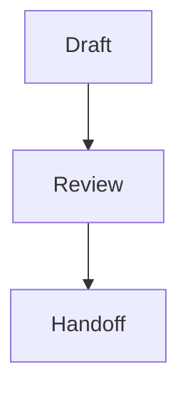

# charter-format — the normative Charter block catalog

A Charter deliverable is a `.charter.md` file: **CommonMark prose plus `:::` directive containers**
(Markdig custom containers), each validated against a C# record in `Charter.Core`. This skill is the
**single source of truth** for that format — the block catalog, each block's semantics, and the
`:::question` open/resolved rule. It is bound to the renderer by a drift test (`Charter.Core.Tests`), so
this catalog and the real `BlockKind` set / `QuestionSpec` fields can never silently diverge.

Do not invent, fork, or vendor this catalog. Cite this skill.

## Format version

This skill declares the format range it understands in its frontmatter:

- `format-version: 1` — the newest catalog version this skill defines (`skillMax`).
- `format-min: 1` — the oldest file format it still understands (`skillMin`).

A `.charter.md` stamps the format it was authored against in a plain-YAML frontmatter marker
(`charter-format-version: F`, readable without this skill). It is consumable iff
`format-min ≤ F ≤ format-version`. **Any change to the catalog below bumps `format-version`** — the drift
test binds the version to the code, so a semantic change with no bump fails the build.

## The block catalog (the only blocks that exist)

Primitives are plain CommonMark. The `:::` directives are the rich, validated blocks.

| Block | Syntax | Semantics |
|---|---|---|
| prose / heading / list / table / code | plain CommonMark | Narrative and data. Annotatable as a whole block, or as a text range inside it. (Per-line sub-anchors exist only for `:::diff`; a code block has none.) |
| note callout | `:::note` | An aside. Rendered as a callout; annotatable as a whole element. |
| warn callout | `:::warn` | A risk the reviewer must not miss. A callout; annotatable as a whole element. |
| comparison | `:::comparison` | Options weighed side by side — a pipe table or list body. Annotatable **per row**. |
| diagram | `:::diagram` | A Mermaid diagram. Body is Mermaid source — raw, **or** wrapped in a fenced ` ```mermaid ` block (both accepted; see below). Rendered theme-aware; annotatable **per node**. |
| diff | `:::diff` | A unified diff. Body is diff lines — raw, **or** wrapped in a fenced ` ```diff ` block (both accepted; see below). Annotatable **per line** (add / remove / context). |
| custom HTML | `:::custom-html` | The sanctioned raw-HTML escape hatch — its body is passed through live (every other surface escapes raw HTML). Reach for it last. |
| **question** | **`:::question`** | The elicitation block — asks the human (or downstream agent) to decide something inside the plan. Validated JSON body; see below. |

There is **no** `:::file-tree` and **no** `:::annotated-code`. They have no renderer — do not author them,
and treat any other unknown `:::foo` as an unknown directive, never as a known block.

**Unknown-directive interop rule.** An unknown `:::foo` is flagged as unknown (never silently promoted to a
note) — but its **body is preserved and parsed through as prose context, never silently dropped**. It is
ordinary plan content that happened to sit behind a directive the catalog does not define (usually a typo);
discarding it would lose real content. Every consumer — renderer, handoff, and any interpreting agent — keeps
both the visible "unknown directive" marker *and* the body.

### `:::diagram` and `:::diff` body forms

Both containers accept **two** body forms, and both mean exactly the same thing. Write either; interpret both.

**Fenced body** (the form the authoring examples use — it keeps editors syntax-highlighting the source):

````markdown
:::diagram

:::
````

**Raw body** (no inner fence):

````markdown
:::diagram
graph TD; Draft --> Review --> Handoff;
:::
````

`:::diff` is identical, with ` ```diff ` as the inner fence:

````markdown
:::diff
```diff
+ added line
- removed line
  context line
```
:::
````

````markdown
:::diff
+ added line
- removed line
  context line
:::
````

When flattening, the body is emitted as **exactly one** fenced code block of the matching language — an
already-fenced body is unwrapped first, never double-fenced.

### Widening a fence when the body contains one

A body may legitimately contain the very characters that delimit it — a diff of a markdown file is the
common case. **Both** delimiters then have to be widened, and getting only one is a silent data loss, not a
rendering glitch:

- **the container**: a line whose trimmed text is a colon run of at least the opening length **closes** the
  block, and everything after it is dropped. Being inside a code fence does **not** protect it — the
  container's close check runs first. Open with `::::` (or more) when any body line starts with `:::`.
- **the code fence**: three backticks are closed by a body line of three backticks. Use ` ```` ` when the
  body contains a fence.

A body line reading `:::note` would otherwise **open a nested directive** and swallow the tail; the code
fence is what prevents that, which is why a machine-generated diff body is always fenced.

````markdown
::::diff
```diff
 :::note
-  a line inside a .charter.md being diffed
+  the block survives because the container is four colons
```
::::
````

Only widen as far as the content requires — an ordinary source diff stays plain `:::diff` + ` ```diff `.
`charter recap` computes both automatically.

## The `:::question` block — open vs. resolved

The body is a JSON object (JSON is a subset of YAML, so the parser stays dependency-agnostic) validated to
`QuestionSpec` in `Charter.Core`. Its fields:

| Field | Type | Required | Meaning |
|---|---|---|---|
| `id` | string | yes | Stable, **document-unique** question id. (Two questions sharing an id is a review-time error — an answer would resolve into both.) |
| `title` | string | yes | The question shown to the reviewer. |
| `mode` | string | yes | One of `single` / `multi` / `free-text` / `bool` / `number`. |
| `options` | array of strings | for `single`/`multi` | The choices. Required and non-empty for the select modes; unused otherwise. |
| `target` | string | yes | `human` or `agent` — who the resolved answer routes to. |
| `recommended` | string | no | The option the **authoring agent** would choose. Must equal one of `options` verbatim; a value matching none is ignored. |
| `answer` | array of strings | no | **The open/resolved marker.** Absent or empty ⇒ the question is **open**. Non-empty ⇒ **resolved**, carrying the chosen value(s). |

The `answer` shape mirrors a submitted answer's values: a `single`/`bool`/`number` answer is one element, a
`multi` answer is the selected values, and `free-text` is the text as one element.

**An answer value may legitimately fall OUTSIDE `options`.** The renderer appends a "Something else" free-text
escape hatch to every `single`/`multi` form, because the agent writing the options is the party least
qualified to know they are exhaustive — it is asking precisely because it does not know. A reviewer can
therefore answer in their own words, and that answer arrives as an ordinary `answer` element that matches no
declared option. **Treat it as the decision, not as corruption**: do not validate `answer ⊆ options`, do not
drop it, and do not "correct" it to the nearest option. Nothing in Charter enforces membership, and the
renderer already displays such a value as a checked write-in.

Note this hatch is **emitted by the renderer, never authored**. Do not add an "Other" string to `options`
yourself: `charter handoff` emits the option list verbatim into the CommonMark Guardrails consumes, so an
authored "Other" would become a real choice in the data model — one the agent never actually proposed.

### `recommended` — the agent's lean, as a field

`recommended` names the option the authoring agent would pick. The renderer marks that option's **label**
`(Recommended)` — the convention Claude Code's own `AskUserQuestion` uses, so reviewers already read it —
while the submitted **value** stays the bare option.

**Never put `(Recommended)` inside an `options` string.** It looks equivalent and is not, for two reasons
that only surface later:

- an option's text is also its submitted **value**, so the recorded decision would read
  `"Postgres (Recommended)"` and carry a transient authoring hint into the permanent answer and into
  everything downstream of `handoff`;
- the question **fingerprint** hashes `options`, so adding or withdrawing a recommendation would change the
  fingerprint and **stale an answer the human already gave** — `charter resolve` would then refuse to apply
  it without `--apply-stale-answers`.

`recommended` is deliberately **not** part of the fingerprint: a changed lean does not change what was
asked, so an agent revising its own opinion must never invalidate a human's decision.

````markdown
:::question
{ "id": "db-choice", "title": "Which datastore for the read path?",
  "mode": "single", "options": ["Postgres", "DynamoDB"], "recommended": "Postgres",
  "target": "human" }
:::
````

Interpreting it: on an **open** question it says which way the plan was heading. On a **resolved** one it is
sharper — an `answer` that differs from `recommended` is a human deliberately overriding the agent, and work
built from that plan must not drift back toward the rejected option.

**Open** (as authored):

````markdown
:::question
{ "id": "db-choice", "title": "Which datastore for the read path?",
  "mode": "single", "options": ["Postgres", "DynamoDB"], "target": "human" }
:::
````

**Resolved** (the `answer` key is added on drain — every other key is preserved):

````markdown
:::question
{ "id": "db-choice", "title": "Which datastore for the read path?",
  "mode": "single", "options": ["Postgres", "DynamoDB"], "target": "human", "answer": ["Postgres"] }
:::
````

Interpreting a question: a **resolved** question is a settled decision — fold its `answer` in, keeping the
`options` as rationale. An **open** question must be surfaced, never silently defaulted.
