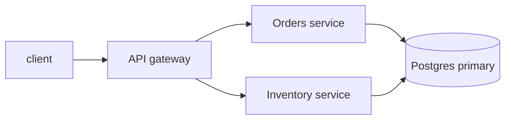

# Authoring a rich `.charter.md` from any source

This is the on-ramp: turn **any** input — a bare prompt, a markdown file, a PDF, a link, a Confluence
page — into a rich, reviewable Charter plan. The input varies; the output is always the same shape: a
block-structured `.charter.md` that reads well, elicits the decisions that are actually open, and is ready
for the review loop. Don't just transcribe the source — **author** from it.

## Step 1 — Ingest the source

Get the source's content in front of you before you write a line of plan. How depends on what it is:

| Source | How to ingest |
|---|---|
| A prompt / free-form ask | Nothing to read — author the plan from scratch, inventing the structure the ask implies. |
| A markdown file | Read it. Keep its intent; you're enriching it into blocks, not rewriting its meaning. |
| A PDF | Read it with your file tools (the `Read` tool takes a `pages` range). Pull out its headings, tables, and diagrams-in-prose. |
| A link / public web page | Fetch it (`WebFetch`, or a configured MCP connector). |
| A **private** Confluence page | An auth wall, not a content problem — a plain fetch hits a login page. Use an **Atlassian MCP connector** if one is configured, or ask the human for a **manual export** (Confluence → Export → Markdown or PDF) and treat it as the markdown/PDF case above. This is an environment step; you can't bypass the auth. |

If the source is thin (a one-line ask), that's fine — you're expected to add the structure. If it's rich
(a design doc), your job is to *lift* its structure into the right blocks, not flatten it back to prose.

## Step 2 — Author a rich plan: choose the right block for the content

The whole point of Charter over a plain `.md` is that the right content gets the right **block** — rendered
specially, annotatable as a unit, and (for decisions) elicited reliably. Walk the source and map each piece
to a block. **Pass ordinary narrative through as prose** — goals, rationale, and framing are the bulk of a
plan and belong in plain markdown.

| The content is… | Author it as… |
|---|---|
| a flow, an architecture, a sequence, a state machine | `:::diagram` (a Mermaid diagram) |
| options / trade-offs weighed against each other | `:::comparison` |
| a decision that is genuinely **open** — the reviewer must choose | `:::question` (omit `answer` ⇒ open) |
| structured data, a matrix, a spec table | a plain pipe table |
| an aside worth setting apart | `:::note` |
| a risk the reviewer must not miss | `:::warn` |
| a concrete change to existing text/code | `:::diff` |
| a code snippet | a fenced ` ```lang ` block |
| a shape nothing above expresses (a wireframe) | `:::custom-html` — the escape hatch, reached for last |
| everything else — narrative, goals, rationale | plain prose |

The exact block catalog, each block's syntax and annotation granularity, and the full `:::question` schema
(`id` / `title` / `mode` / `options` / `target` / `answer`, and the open-vs-resolved rule) are **normative
in the `charter-format` skill** — the single source of truth. Cite it; don't restate it here. The
catalog-in-depth walkthrough with copy-ready snippets is in [`authoring-plans.md`](authoring-plans.md).

### Before / after: an "Open Questions" section → `:::question` blocks

A source that ends with a bulleted "Open Questions" list is the clearest signal you have real decisions to
elicit. Turn each into a `:::question` and **leave it open** — omit `answer`, and the reviewer resolves it in
the browser.

Before (as found in the source):

```
## Open Questions
- Which datastore should the read path use — Postgres or DynamoDB?
- Do we need multi-region on day one?
```

After (authored):

````
:::question
{ "id": "read-datastore", "title": "Which datastore should the read path use?",
  "mode": "single", "options": ["Postgres", "DynamoDB"], "target": "human" }
:::

:::question
{ "id": "multi-region-v1", "title": "Multi-region on day one?",
  "mode": "bool", "target": "human" }
:::
````

The body is JSON, the `mode` token is one of the values the `charter-format` skill defines, and the absent
`answer` is what marks each question **open** — see `charter-format` for the schema.

### Before / after: an architecture paragraph → a `:::diagram` candidate

Prose that describes what-calls-what is almost always clearer as a diagram. If you can draw it, draw it.

Before (a paragraph in the source):

> The client calls the API gateway, which fans out to the orders service and the inventory service; both
> read from the shared Postgres primary.

After (authored):

````
:::diagram

:::
````

## Step 3 — Stamp the format marker

Begin the file with the plain-YAML frontmatter marker declaring the format version it was authored against:

```
---
charter-format-version: 1
---
```

The marker's meaning and the **current version number** are normative in the `charter-format` skill (it also
defines the consumable range) — treat that skill as authoritative rather than hard-coding a version you
assume. `1` is the current value at time of writing; confirm against `charter-format`.

## Step 4 — Hand off to the review loop

Authoring is the start of the loop, not the end. Once the plan is written:

1. **Check it** — `charter render plan.charter.md -o plan.html` and open the artifact to sanity-check layout.
2. **Put it in front of the human** — `charter review plan.charter.md`. They annotate blocks in place and
   answer the `:::question` forms in the browser.
3. **Fold their answers back into the file** — an agent looping the review runs `charter poll --apply`; a
   solo human reviewer runs `charter resolve`. Either one writes each chosen answer **inline** into its
   `:::question` block (the living-document write), so the plan itself carries the resolved decisions.
4. **Hand off** — when the plan is approved, `charter handoff` converts it to the plain CommonMark the
   headless Guardrails path consumes; the interactive `/plan-breakdown` can also read the `.charter.md`
   directly via the `charter-format` skill.

The loop mechanics (running `charter review`, how the human annotates, draining feedback) are in
[`review-loop.md`](review-loop.md); the Guardrails handoff is in [`handoff.md`](handoff.md).
