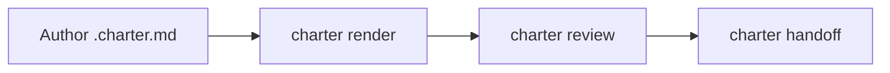
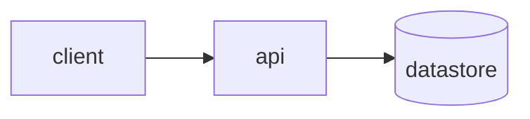

# Authoring Charter plans — the block catalog in depth

A Charter plan is a `.charter.md` file: **CommonMark prose plus `:::` directive containers** (Markdig custom
containers), each validated against a C# record. The file **begins with a small plain-YAML frontmatter
marker** declaring the format version it was authored against — readable without any Charter tooling:

```
---
charter-format-version: 1
---
```

The marker and the format range are normative in the `charter-format` skill (the format single source of
truth); keep it a mention here. Write the narrative as ordinary markdown; reach for a
directive only when a block needs to be *rendered specially*, *annotated as a unit*, or *elicit a
decision*. The catalog below is single-sourced in
`docs/plans/01-combine-lavish-and-visual-plan.md` (§ *Format & block catalog*) — invariant 3, *format
single-sourced*: this playbook cites that catalog; the renderer owns it. Don't invent new directives.

## Why this shape

The load-bearing idea (decision D1 in the plan) is that the value of "MDX blocks" is a **validated block
schema**, not JSX. Narrative markdown stays free-form because a rigid format degrades an LLM's reasoning;
the strict schema is confined to `:::question`, where reliable structured elicitation matters. Every
block gets a **content-derived stable ID** and the renderer keeps a **source-map (anchor ID → markdown
line range)**, so a human's annotation on the rendered HTML round-trips to the exact markdown line you
edit (invariant 2, *comment-in-place with round-trip*).

## The catalog

### Prose, headings, lists — plain markdown

Ordinary CommonMark. Annotatable as a **text range** (the human selects a span inside the block). Use it
for everything that isn't a specialized block — the bulk of a plan is prose.

### Callouts — `:::note` / `:::warn`

```
:::note
Ship the read path first; the write path lands in a follow-up.
:::

:::warn
This migration is irreversible once the backfill starts.
:::
```

Annotatable as a whole element. Use `:::note` for asides and `:::warn` for risks the reviewer must not
miss.

### Tables & comparisons — pipe tables · `:::comparison`

A plain pipe table for data; `:::comparison` when you're weighing options and want per-option/per-row
annotation:

```
:::comparison
| Option | Latency | Ops cost | Risk |
|---|---|---|---|
| Postgres | low | medium | low |
| DynamoDB | very low | high | medium |
:::
```

### Code & diffs — fenced blocks · `:::diff`

A fenced ```` ```lang ```` block renders syntax-highlighted code, annotatable per line. Use `:::diff`
to show a change (annotatable per line):

````
:::diff
```diff
- var timeout = TimeSpan.FromSeconds(5);
+ var timeout = TimeSpan.FromSeconds(30);
```
:::
````

### Diagram — `:::diagram` (Mermaid body)

A Mermaid diagram. Rendered theme-aware, **pan/zoom**, and annotatable **per node** (the human clicks a
node and comments on it):

````
:::diagram

:::
````

### Escape hatch — `:::custom-html`

Sanitized inline HTML for a wireframe or a ceiling case the other blocks can't express. Annotatable as an
element. Reach for it last — the more expressive the block, the less constrainable it is.

```
:::custom-html
<div class="wireframe">…</div>
:::
```

### Question (elicitation) — `:::question`

The one block with a **strict, validated schema** — it's how you ask the human to *decide* something
inside the plan. The body is a payload (YAML/JSON) validated against a C# record:

| Field | Meaning |
|---|---|
| `id` | Opaque, stable question id — you reference it later in the `--answers` handoff JSON. |
| `title` | The question shown to the reviewer. |
| `mode` | One of `single-select`, `multi-select`, `free-text`, `boolean`, `number`. |
| `options` | The choices (for the select modes). |
| `target` | `human` or `agent` — who the resolved answer is routed to on handoff. |

```
:::question
id: db-choice
title: Which datastore should the service use?
mode: single-select
target: agent
options:
  - Postgres
  - DynamoDB
  - SQLite
:::
```

It renders to a native HTML `<form>`. When the human submits, the review server queues a structured
answer that you drain from `GET /api/answers` (see `review-loop.md`), and that same `id` is what you map
in the `--answers` JSON at handoff (see `handoff.md`). A `:::question` left unanswered becomes an "Open
question" line in the handoff — a legitimate, common outcome.

## A sample `.charter.md` skeleton

```
# Payments service — reviewable plan

Short framing paragraph: what we're building and why, in plain prose.

## Goal

A couple of sentences of narrative markdown stating the outcome.

:::note
Scope is the read path only; writes are a follow-up plan.
:::

## Approach

:::comparison
| Option | Latency | Ops cost | Risk |
|---|---|---|---|
| Postgres | low | medium | low |
| DynamoDB | very low | high | medium |
:::

:::diagram

:::

## Decisions we need from you

:::question
id: db-choice
title: Which datastore should the service use?
mode: single-select
target: agent
options:
  - Postgres
  - DynamoDB
:::

:::warn
Whichever we pick, the migration is irreversible once the backfill starts.
:::
```

Render it with `charter render plan.charter.md -o plan.html` to sanity-check layout, then take it into the
review loop (`references/review-loop.md`).
