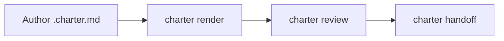
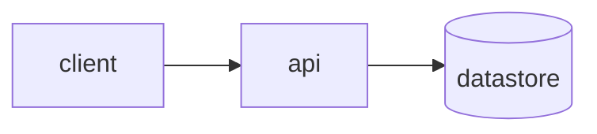

# Authoring Charter plans — the block catalog in depth

A Charter plan is a `.charter.md` file: **CommonMark prose plus `:::` directive containers** (Markdig custom
containers), each validated against a C# record. The file **begins with a small plain-YAML frontmatter
marker** declaring the format version it was authored against — readable without any Charter tooling:

```
---
charter-format-version: 1
---
```

The marker and the format range are normative in the `charter-format` skill (the format single source of
truth); keep it a mention here. Write the narrative as ordinary markdown; reach for a
directive only when a block needs to be *rendered specially*, *annotated as a unit*, or *elicit a
decision*. The catalog below is single-sourced in the **`charter-format`** skill (invariant 3, *format
single-sourced*): this playbook cites that catalog; the renderer owns it and a drift test binds them.
Don't invent new directives.

## Why this shape

The load-bearing idea (decision D1 in the plan) is that the value of "MDX blocks" is a **validated block
schema**, not JSX. Narrative markdown stays free-form because a rigid format degrades an LLM's reasoning;
the strict schema is confined to `:::question`, where reliable structured elicitation matters. Every
block gets a **content-derived stable ID** and the renderer keeps a **source-map (anchor ID → markdown
line range)**, so a human's annotation on the rendered HTML round-trips to the exact markdown line you
edit (invariant 2, *comment-in-place with round-trip*).

## The catalog

### Prose, headings, lists — plain markdown

Ordinary CommonMark. Annotatable as a **text range** (the human selects a span inside the block). Use it
for everything that isn't a specialized block — the bulk of a plan is prose.

### Callouts — `:::note` / `:::warn`

```
:::note
Ship the read path first; the write path lands in a follow-up.
:::

:::warn
This migration is irreversible once the backfill starts.
:::
```

Annotatable as a whole element. Use `:::note` for asides and `:::warn` for risks the reviewer must not
miss.

### Tables & comparisons — pipe tables · `:::comparison`

A plain pipe table for data; `:::comparison` when you're weighing options and want per-option/per-row
annotation:

```
:::comparison
| Option | Latency | Ops cost | Risk |
|---|---|---|---|
| Postgres | low | medium | low |
| DynamoDB | very low | high | medium |
:::
```

### Code & diffs — fenced blocks · `:::diff`

A fenced ```` ```lang ```` block renders as monospaced code. The language tags the block but **nothing
highlights it** — no colour carries meaning, so say in prose what matters about the snippet. Annotatable as a
whole block, or as a text range inside it. `:::diff` shows a change, and is the one code surface annotatable
**per line**:

````
:::diff
```diff
- var timeout = TimeSpan.FromSeconds(5);
+ var timeout = TimeSpan.FromSeconds(30);
```
:::
````

### Diagram — `:::diagram` (Mermaid body)

A Mermaid diagram. Rendered theme-aware as inline SVG, and annotatable at **two** granularities: **per
node** (the human Alt+clicks a node and comments on it) and **as a whole block** (Alt+click anywhere else in
the diagram — background, padding, an edge). Both anchor to the diagram block itself:

````
:::diagram

```mermaid
flowchart LR
    author[Author .charter.md] --> render[charter render]
    render --> review[charter review]
    review --> handoff[charter handoff]
```
:::
````

**An oversized diagram pans and zooms — during `charter review`, and only there.** Mermaid renders with
`useMaxWidth`, so a diagram wider than the review column never overflows: it **shrinks**, until the node
labels cannot be read and no scrollbar ever appears to say so. The review SDK detects exactly that (the
SVG's intrinsic `viewBox` width against its rendered width) and gives that block a zoom bar
(`−` · % · `+` · **Reset**), **Ctrl/⌘+scroll** to zoom about the pointer, **drag** to pan, and **arrow keys**
to pan it once focused (`0` resets). A diagram that **fits gains nothing** — no chrome, no tab stop, no
change in behaviour. Alt+click still annotates at every zoom level.

> **Say "Option" to a reviewer on a Mac.** The modifier is `event.altKey` everywhere, but the keycap is
> `⌥ Option` on macOS and `Alt` elsewhere — and a reviewer told to press a key their keyboard does not have
> reads it as "diagrams are not commentable". The SDK's own hint picks the right word per platform; use both
> names if you write the gesture into a plan.

**The saved and exported artifact renders the diagram statically.** Pan/zoom is review-time SDK chrome
(invariant 1, *portable artifact*), so it is not in the file you hand to a person or attach to a ticket. The
authoring consequence: a diagram only legible when zoomed is legible **only in review**. If the artifact is
going to matter, split it into two diagrams rather than relying on the reviewer's zoom.

### Escape hatch — `:::custom-html`

Sanitized inline HTML for a wireframe or a ceiling case the other blocks can't express. Annotatable as an
element. Reach for it last — the more expressive the block, the less constrainable it is.

```
:::custom-html
<div class="wireframe">…</div>
:::
```

### Question (elicitation) — `:::question`

The one block with a **strict, validated schema** — it's how you ask the human to *decide* something
inside the plan. The body is a **JSON object** (parsed as JSON, which is a subset of YAML) validated
against a C# record. Its fields — `id`, `title`, `mode`, `options`, `target`, and the optional `answer` —
the exact `mode` tokens, and the **open-vs-resolved rule** (omit `answer` ⇒ open; a non-empty `answer` ⇒
resolved) are normative in the **`charter-format`** skill. Cite that skill for the schema rather than
restating it here.

```
:::question
{ "id": "db-choice", "title": "Which datastore should the service use?",
  "mode": "single", "options": ["Postgres", "DynamoDB", "SQLite"], "target": "agent" }
:::
```

It renders to a native HTML `<form>`. When the human submits, the review server queues a structured answer
you drain with `charter poll` (see `review-loop.md`); `charter poll --apply` or `charter resolve` then
folds it **inline** into the block's `answer` field, resolving the question in place. A `:::question` left
open (no `answer`) is a legitimate, common outcome — surfaced, never silently defaulted.

#### Say which one you'd pick

You have usually just read the code, the trade-offs and the history before writing the question. **Withholding
which way you lean makes the reviewer re-derive a conclusion you already reached.** Name it with
`recommended`, and put that option **first**:

```
:::question
{ "id": "db-choice", "title": "Which datastore should the service use?",
  "mode": "single", "options": ["Postgres", "DynamoDB", "SQLite"],
  "recommended": "Postgres",
  "rationale": "Cheapest option that still fixes the installed base; DynamoDB only wins if the write path outgrows one region this year.",
  "target": "human" }
:::
```

The renderer marks that option `(Recommended)` for the reviewer; the submitted value stays the bare option.
Ordering is yours — `recommended` marks, it does not reorder.

Three rules, and the last two are what keep this useful rather than corrosive:

- **Say why in `rationale` — the field, not the prose around it.** A bare badge invites a rubber stamp. One
  or two sentences — *"cheapest option that still fixes the installed base"* — is what lets the reviewer
  disagree with your REASONING rather than just your conclusion. A recommendation without a reason is worse
  than none.

  Put it in the field, because a paragraph beside the block is bound to it by nothing: a reviewer met one
  sitting between two questions and read it as the introduction to the one *below*, answering one question
  while reading the argument for another. `rationale` renders inside the box, so the binding is visible
  rather than assumed.
- **Omit it when you honestly don't have a lean.** Some questions are genuine coin-flips; others turn on
  information only the human has — budget, roadmap, appetite, who has to maintain it. A recommendation there
  is noise at best and false confidence at worst.
- **Anchoring is a real cost.** A reviewer skimming four questions may accept all four defaults, so a
  recommendation you would not defend in conversation is one you should not write. Recommend where you have
  a defensible position; leave the rest open.

Never write `(Recommended)` into an `options` string yourself — the option text is also the submitted value,
so the marker would end up in the recorded decision and would stale answers the human has already given.
`charter-format` has the full reasoning.

## A sample `.charter.md` skeleton

````
# Payments service — reviewable plan

Short framing paragraph: what we're building and why, in plain prose.

## Goal

A couple of sentences of narrative markdown stating the outcome.

:::note
Scope is the read path only; writes are a follow-up plan.
:::

## Approach

:::comparison
| Option | Latency | Ops cost | Risk |
|---|---|---|---|
| Postgres | low | medium | low |
| DynamoDB | very low | high | medium |
:::

:::diagram

```mermaid
flowchart LR
    client --> api --> store[(datastore)]
```
:::

## Decisions we need from you

:::question
{ "id": "db-choice", "title": "Which datastore should the service use?",
  "mode": "single", "options": ["Postgres", "DynamoDB"], "target": "agent" }
:::

:::warn
Whichever we pick, the migration is irreversible once the backfill starts.
:::
````

Render it with `charter render plan.charter.md -o plan.html` to sanity-check layout, then take it into the
review loop (`references/review-loop.md`).
